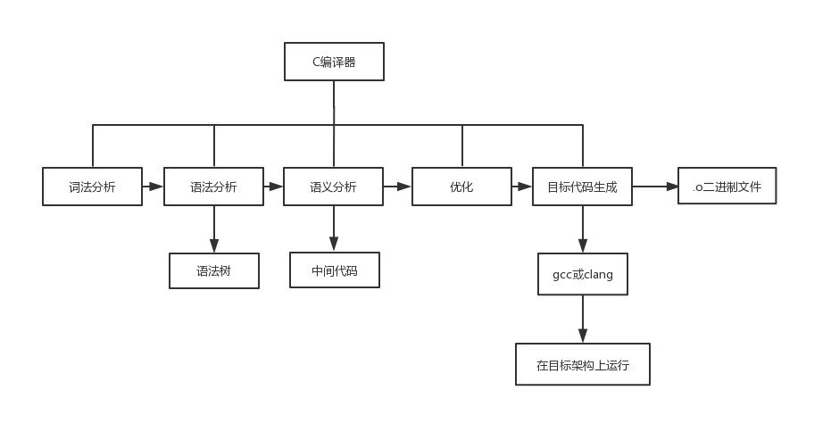
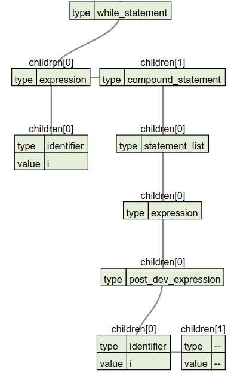
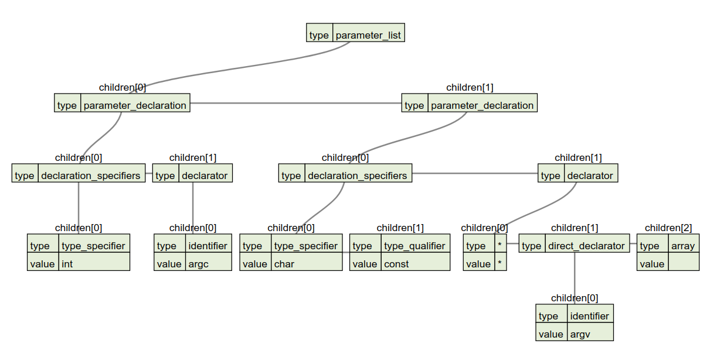
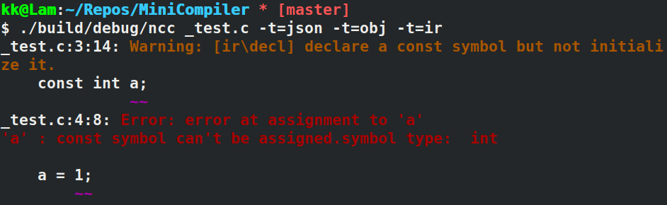

# ANSI-C语言编译器设计实验报告

> 具体这一页留空，到时候放学校的实验报告封面

<div style="page-break-after: always;"></div>

[TOC]

## 一、序言

### 实验目的
- 用lex写出一个类C或者类PASCAL某个语言的词法分析器，用YACC的分析方法完成语法分析，并生成语法树和中间代码,最终生成可执行的目标代码。
  - 可视化抽象语法树
  - 生成中间代码
  - 代码优化
  - 生成可执行的目标代码
### 编译器主体流程



### 实现情况

- [√] 支持的语法
	- [√] C基本语法
- [√] 语法树的生成与可视化
- [√] 错误报告
	- [√] ptrtty print
	- [√] 基本语法错误、类型错误（赋值）

- [√] 中间代码
  - [√] control flow
  - [√] loop
  - [√] assignment expression
  - [√] basic operations: +, -, *, /
  - [√] function call
  - [√] unspecified parameter
  - [√] auto format transformation
    - [√] 加减乘除自动类型转换
    - [√] int/float/bool之间的类型转换
  - [√] const
  - [√] variable definition
  - [√] pointer type 
	- [√] dereference: '*', '.', '->'与类型堆栈
	- [√] list initialization
- [√] 优化
	- [√] llvm底层优化
	- [√] 编译时常量计算（int a = 1+2+4*5）
	- [√] 无用代码消除
- [√] 目标代码
	- [√] 编译运行后查看返回值
	- [√] 反汇编以查看汇编代码


## 二、实验环境

- 开发环境：

  - Fedora
  - Ubuntu

- 开发工具：

  | 工具名称 | 最低版本 | 功能                   |
  | -------- | -------- | ---------------------- |
  | cmake    | 3.3      | 构建跨平台的开发环境   |
  | g++      | 7.4.0    | 开发使用编译器         |
  | flex     | 2.6.4    | 词法分析               |
  | bison    | 3.0.4    | 语法分析               |
  | llvm     | 6.0.0    | 中间代码生成及目标代码 |
  | git      | 2.17.1   | 代码版本管理工具       |

## 三、词法分析

### 基本的词法规则

我们的`MiniCompiler`的词法部分完全兼容ANSI C的词法部分，支持所有的ANSI C的关键字，并且支持`...`不定参数的词法形式和支持用`<%`和`%>`替代`{`和`}`以及用`<:`和`:>`替代`[`和`]`的词法。

基本的词法部分的实现比较简单，为了避免关键字和`identifier`的冲突，关键字放在`identifier`的上面，提高优先级。

### 特殊的词法规则

除了基本的词法以外，相对复杂的词法就是注释和一些常量的词法，在这里，我们的词法分析器除了ANSI C支持的块注释以外，还支持单行注释。下面介绍一下我们的实现情况。

#### 注释

词法分析器支持注释有助于我们后期的测试，我们实现了单行注释以及块注释：

- 块注释

  块注释的正则表达式如下：

  ```
  block_comment	\/\*([^*]*\*+[^/*])*([^*]*\*+)\/
  ```

  - <font color=orange>\/\\\*</font>匹配块注释开头的`/*`
  - <font color=orange>(\[^\*\]\*\\\*+\[^/\*\])\*</font>匹配若干个不是`*\`的但包含至少一个`*`的串
  - <font color=orange>(\[^\*]\*)</font>匹配不包含`*`的串
  - <font color=orange>\\\*+\/</font>匹配第一个出现的`*/`

- 行注释

  行注释的正则表达式如下：

  ```
  line_comment	\/\/.*
  ```

  行注释相对简单很多，只要匹配到第一个`//`，后面的所有字符都忽略，直到换行符为止。

  - <font color=orange>\\/\\/</font>匹配行注释开头的`//`
  - <font color=orange>.*</font>匹配非换行符的任意字符

#### 常量

- 字符

  在ANSI C里，我们允许单引号内有超过一个字符，这只是一个警告，所以我们词法分析器保持这个特性，对应的正则表达式如下：

  ```
  char			\'(\\.|[^\\'])*\'
  ```

  - <font color=orange>\\'</font>匹配开头的单引号`'`
  - <font color=orange>\\\.</font>匹配以`\`开头后加任意非换行符的字符的转义字符
  - <font color=orange>\[^\\\\'\]</font>匹配不以`\`开头的正常字符
  - <font color=orange>(\\\\.|\[^\\\\'\])*</font>表示匹配转义字符和正常字符若干个
  - <font color=orange>\\'</font>匹配最后结束的单引号`'`

- 字符串

  字符串的正则表达式如下：

  ```
  string			\"([^\\"\n]|\\.)*\"
  ```

  这部分和上面的字符正则表达式比较相似，就不作过多的解释了。

- 十六进制的整型

  十六进制的整形的正则表达式如下：

  ```
  hex_num			0[xX][a-fA-F0-9]+
  ```

  我们的整形支持十进制和十六进制的形式，而十六进制的整数的值转换为十进制整数的值的过程是在词法分析过程中实现的，我们使用以下这个函数作转换：

  ```c++
  inline std::string hex2num()
  {
  	unsigned long res = 0;
  	char c;
  	for (int i = 2; i < yyleng; ++i)
  	{
  		c = yytext[i];
  		res = res * 16 + (c <= '9' ? (c - '0')
  								   : (c & 0xdf) - 'A' + 10);
  	}
  	return std::to_string(res);
  }
  ```

- 指数型浮点数

  指数型浮点数的正则表达式如下：

  ```
  e_float			({num}|{float_num})[eE][+-]?{num}
  ```

  同样，我们的指数型浮点数也会通过以下这个函数转换成一般的浮点数的格式：
  
  ```c++
  inline std::string e2float()
  {
  	double head = 0;
  	long exp = 0;
  	for (int i = 0; i < yyleng; ++i)
  	{
  		if ((yytext[i] & 0xdf) == 'E')
  		{
  			head = std::stod(std::string(yytext).substr(0, i));
  			exp = std::stoi(std::string(yytext).substr(i+1));
  			break;
  		}
  	}
  	return std::to_string(pow(10, exp)*head);
  }
  ```

### 构建终结符节点

在词法分析阶段，我们把每一个token的类型和值用于构建后期使用的AST的节点中。我们设计的AST的节点类型如下：

```c++
class Node
{
public:
    Node(const std::string &type) : type(type){};
    Node(const std::string &type, const std::string &value);
    Node(const std::string &type, const std::string &value, int x1, int y1, int x2, int y2);
    Node(const std::string &type, std::pair<int, int> left, std::pair<int, int> right);

    std::pair<int, int> get_left() const { return {pos[0], pos[1]}; }
    std::pair<int, int> get_right() const { return {pos[2], pos[3]}; }

    void set_left(const std::pair<int, int> &xy);
    void set_right(const std::pair<int, int> &xy);

public:
    std::string type;
    int pos[4] = {0};
    std::vector<std::shared_ptr<Node>> children;
    std::string value; // only used for a few non-terminals
};
```

其中比较特别的是，我们在词法分析阶段，保留了token所在源文件的位置信息，这个用两个坐标进行表示：`left(linenum, pos)`和`right(linenum, pos)`，这样方便后期打印错误信息的友好化。在yacc中，我们把yylval的类型修改为语法树节点的智能指针类型。

所以，最终我们的节点是这样构建的，这里以identifier作为例子：

```c
{identifier}	{
    yylval=std::make_shared<ast::Node>("identifier",	
                                       yytext,
                                       yylineno, 
                                       ypos, 
                                       yylineno, 
                                       ypos+yyleng); 
    ypos+=yyleng; return IDENTIFIER;}
```

## 四、语法分析

语法分析阶段我们需要做的事情是构建语法树以及打印出语法树。下面是我们用yacc编写时考虑到的地方。

### 基本的语法规则

我们yacc中，实现了完整的ANSI C语法，根据需要，我们定义了一下一些token

```c
%token IDENTIFIER CONSTANT STRING_LITERAL SIZEOF
%token PTR_OP INC_OP DEC_OP LEFT_SHIFT_OP RIGHT_SHIFT_OP LE_OP GE_OP EQ_OP NE_OP
%token AND_OP OR_OP MUL_ASSIGN DIV_ASSIGN MOD_ASSIGN ADD_ASSIGN
%token SUB_ASSIGN LEFT_SHIFT_ASSIGN RIGHT_SHIFT_ASSIGN AND_ASSIGN
%token XOR_ASSIGN OR_ASSIGN

%token TYPEDEF EXTERN STATIC AUTO REGISTER
%token CHAR SHORT INT LONG SIGNED UNSIGNED FLOAT DOUBLE CONST VOLATILE VOID
%token STRUCT UNION ENUM ELLIPSIS

%token CASE DEFAULT IF ELSE SWITCH WHILE DO FOR GOTO CONTINUE BREAK RETURN
```

语法则与ANSI C中的BNF一致。

### ELSE悬挂问题

在这里，我们需要明确的是，我们的语法是有else悬挂的问题的，这里我们在yacc中指明else使用最近匹配的原则。这需要我们在前面定义两个优先级：

```c
%nonassoc IFX 
%nonassoc ELSE
```

然后在语法中：

```c
selection_statement
: IF '(' expression ')' statement %prec IFX			{}
| IF '(' expression ')' statement ELSE statement	{}
| SWITCH '(' expression ')' statement 				{}
;
```

这样ELSE的优先级更高所以在匹配的时候，就会是最近匹配。

### 算符优先级问题

而对于运算符优先级的处理上，我们是以修改语法的方式实现的。所以不需要像ELSE悬挂问题一样在先前定义各种算符的优先级问题。

### 构建非终结符节点

构建非终结符的节点是为了生成一个比较合适的语法树，以便于后期生成中间代码。最简单的方式是对于每一条规则，它右侧的每一个符号都是这个非终结符的孩子。但是这种方式生成出来的语法树过于冗杂，并没有助于后期的中间代码生成。而如果生成最简的抽象语法树，又会导致在生成过程中比较复杂，而且最简单的语法树也并不一定有助于中间代码的生成，所以这里我们采用比较折中的方式，根据我们的中间代码的生成需求，生成合适的语法树，对于一些不必要冗余的节点进行删减，但依然保留一部分非终结符，并不生成最简的抽象语法树。

举一个简单的例子，我们在循环语句中，生成的语法树会把括号这个终结符对应的语法树节点去掉，只留下条件表达式以及循环主体部分。



> 这部分对应的c代码是：
>
> ```c
> while (i)
> {
> 	i--;
> }
> ```

以及在函数参数列表中，我们也修改了相应的格式：



> 这部分对应的c代码是：
>
> ```c
> int main(int argc, char const *argv[])
> {
>     /* code */
>     return 0;
> }
> ```
>
> 其中截取部分是`int argc, char const *argv[]`

## 五、语义分析

### 符号表

#### 类型的设计

##### 根类型

由于**LLVM**本身提供的类型没有`const`属性，并且直接使用起来不方便，因此我们需要封装我们自己的type类。`RootType`设计如下：

```c++
enum TypeName
{
    Void,
    Integer,
    Float,
    Pointer,
    Array,
    Struct,
    Function,
    Enum
};
class RootType
{
public:
    TypeName type_name;
    llvm::Type *_ty;
    bool is_const;
}
```

所有的类型都派生自此基类。基类含有三个成员，一个是type_name，用来描述类型本身。由于在**LLVM**中，`bool`可用`int(1)`表示，char可用`int(8)`表示，`double`可以用`float(64)`表示，因此基本类型只有` Void`,` Integer`, `Float`。Function类型之后会提到。第二个成员是` llvm::Type*`，这是**LLVM**中的原生类型，持有它是为了方便在调用**LLVM**的相关方法时将其传入。第三个成员是一个`bool`，用来表示此类型是否是常数类型。因为在C中，所有的类型，包括基本类型、指针和数组，都是可以被`const`关键字修饰的。并且**LLVM**的基本类型中没有表达`const`属性，因此对于我们自己实现的每个类型，都需要这样一个标志位表示类型的`const`属性。

##### 基础类型

```c++
class BaseType : public RootType
{
public:
    int type_id;
}
```

`BaseType`是基础类型，包括`Integer`, `Float`与`Void`。他们含有一个`type_id`成员。这个成员是他们被实例化时，根据他们的bit位数以及是否有符号来生成的。这个成员的作用就是方便比较两个类型哪一个精度高。因为在后续的隐式类型转换中，是允许低精度类型转化为高精度类型再参与计算的，因此希望用这个`type_id`来方便地实现比较精度的逻辑。此成员的值是这样设计的：

| Type          | bits | signed   | type_id             |
| ------------- | ---- | -------- | ------------------- |
| char          | 8    | signed   | 0000 0000 0000 1000 |
| unsigned char | 8    | unsigned | 0000 0000 0001 0000 |
| int           | 32   | signed   | 0000 0000 0010 0000 |
| unsigned int  | 32   | unsigned | 0000 0000 0100 0000 |
| float         | 32   | signed   | 0000 0000 1000 0000 |

因为C中的类型遵循这样一个基本规则：bit位数少的精度小，signed比unsigned进度高。因此，对于integer类型来说，如果是同位数的类型，signed类型的`type_id`就是bits数，而unsigned类型的`type_id`就是bits<<1。因为类型之间bits数相差至少8位以上，因此这样做是安全的。并且，浮点类型的精度总是高于同bits数的整数类型的。因此浮点类型的`type_id`为bits<<2。如此，整数类型和浮点类型之间比较精度的问题就解决了，`type_id`越大的精度越高。至于`void`类型，c中是不予许声明`void`类型的变量的。`void`除了出现在函数返回值类型的定义外，就只出现在`void *`的场合中。因此，做个特殊判断即可。

##### 指针类型

虽然`array`还没有实现，但是在c中`array`和`pointer`是类似的，都支持解引用。`array`的下标访问说到底也是对`pointer`的解引用。因此，这两类应当继承这一共同基类：

```c++
class ReferType: public RootType
{
public:
	RootType *ele_type;
}
```

这两种类型（后文统称为引用类型）在构造时，需要传入一个其他类型的指针作为参数，以便表达此引用类型所引用的是什么类型。

##### 顶层类型

顶层类型是提供给符号使用的，它是`symbol`的成员之一。它将是我们在编译过程中使用的类型的一个`视图`，我们将以它为准来判断两个符号是否是同一类型，是否可以由一个类型cast到另一个类型等。它的定义如下：

```c++
class Type
{
public:
    BaseType *_bty;
    std::vector<ReferType *> _tys;
}
```

在C中，任意一个类型都可以表示成一个`类型栈`的形式。首先，一个类型一定包含三个基础类型之一(`integer`, `float` 和`void`)，然后在基础类型之上，可以是各种各样的引用类型(`pointer`与`array`)，这些引用类型都是递归的一层一层堆叠的，本层的应用类型引用的是下层的类型。因此，C中任意一个类型都可以用一个堆叠的类型栈来表示。如：`int ***[]**`，它对应的应当是这样一个类型栈：` <int, ptr, ptr, ptr, array, ptr, ptr> `。至此，类型已准备妥当，可以设计符号了。

##### 函数类型

函数类型是在声明和定义函数时使用的。由于在整个编译的过程中，我们使用的是自己的类型系统，所以在

#### 符号的设计

##### 符号的结构

在我们的实现中，除了函数以外的类型都应该用我们的符号类来表示。它被设计成如下结构：

```c++
class Symbol
{
public:
	llvm::Value *value;
    std::string name;
    std::shared_ptr<ir::Type> type;
    bool is_lvalue;
}
```

`symbol`中有四个重要的字段。一个`name`字段用来储存符号的名字，一个`llvm::Value*`字段用来持有**LLVM**中原生的值类型，一个字段` Type*`用来持有我们自己定义的类型，以及一个` bool`标志位用来表示此符号是否是左值。

##### 左右值问题

这个表示左值还是右值的字段是十分必要的。因为在C中，或者说大多数的语言中，每一个类型的变量，都是有左值和右值之分的。左值代表出现在`=`左边的值，是可以被赋值的变量，如`int b`等用户定义出来的变量。而右值代表出现在`=`右边的值，是不可被`写`，只能被`读`的值，如用户代码中各种类型的字面量(` 100.5, 'c'`）。但是在实际使用过程中，左值是可以被当做右值使用的。右值在参与运算后，运算结果是可以被转化为左值的。前者比较好理解，如下代码就是左值被右值使用的情况：

```c
int b = 3; // 定义一个int类型的左值符号b，并用一个int类型的右值符号3来初始化b
int a = b; // 定义一个int类型的左值符号，将b左值符号转化为右值符号，并用来初始化a
```

具体的来说，就是左值符号会持有一个值的指针，而右值符号只持有一个值。因为左值符号可以被赋值，可以修改自己所持有的值，因此左值必须要有它所持有的值的指针，用以修改那个值。而右值符号不必也不能持有一个值的指针。因为右值符号是不能被赋值或修改的，` 3 = 4`这样的语句是违法的。而在上述代码块中，变量`b`发生的左右值转换关系应该是这样的：

| steps  | L or R | type | value | description                                                  |
| :----- | ------ | ---- | ----- | ------------------------------------------------------------ |
| int b; | L      | int  | int * | 初始化b时，b持有一个int*，指向一个int(3)                     |
| a = b; | R      | int  | int   | 将b赋值给a时，b需要从他持有地址处将值load进来。此时b持有的是一个int(3)，而不是int*了。 |

而另一个左右值转换的情况就是，右值在参与某些运算后，运算结果被转化成了左值。一个典型的例子就是指针类型的解引用运算。如下代码呈现了这样的使用情况：

```c
int a = 3;
int *b = &a;
*b = 4;
```

变量`b`一开始被声明为一个左值符号，它的类型是`int*`，它指向了符号`a`所持有的值。而在下一条语句中，`b`由于是指针类型，参与了解引用运算，`*b`的运算结果表示b所指向的值，这个值经过赋值语句被赋值为4。在这个过程中，在变量`b`上所发生的左右值转换是这样的：

| steps      | Lvalue/Rvalue | type | value | description                                                  |
| ---------- | ------------- | ---- | ----- | ------------------------------------------------------------ |
| int *b=&a; | L             | int* | int** | 由于b是一个int*，b可以被重新赋值，指向其他的int，因此，b所持有的应该是一个int**，指向一个int\*。这个int\*可以被重新赋值，指向不同的int。 |
| b          | R             | int* | int*  | 在参与\*运算前，我们要取出`b`所持有的值。则此时创建了一个临时的右值符号，它持有的是从`b`的指向的地址处load进来的一个int\*。 |
| *b         | L             | int  | int*  | 对一个int*进行解引用运算，应当返回一个左值符号。因为我们希望通过给一个左值赋值，给\*b赋值来修改左值指向的值，即a的值。 |

总结起来，一般化的左右值转换过程都遵循如下的相同规律：

* 用v*代替int\*，表示不止适用于int类型
* action表示左右值转换时，需要进行的额外操作
* L <int, v*> 表示符号此时是左值，类型是int，持有的值是一个v\*

| action            | int a;            | int *a;               | int *a[];                           |
| ----------------- | ----------------- | --------------------- | ----------------------------------- |
| Definition        | L<int, v*> \| a=3 | L<int*, v**> \| a=&b  | L<int\*\*, v***> \| a[3]            |
| Load              | R<int, v>  \| b=a | R<int*, v\*>  \| c=a  | R<int\*\*, v**>  \| b=a <=> b=&a[0] |
| Dereference(*/[]) |                   | L<int, v*>    \| *a=3 | L<int\*, v\*\*>    \| a[2]=1        |
| Load              |                   | R<int, v>     \| c=*a | R<int*, v\*>     \| b=a[2]          |
| Dereference(*)    |                   |                       | L<int, v*>       \| *a[2]=3         |
| Load              |                   |                       | R<int, v\*>      \| b=*a[2]         |

可以说，不管是数组类型还是指针类型，在`dereference(解引用)`的过程中右值向左值的变换过程是确定的；对于基本类型来说，在`Load(装载)`过程中，左值向右值变换的过程也是确定的。因此，实现了符号对应的左右值的转变逻辑，我们就可以放心的在编译过程中使用我们的符号了。

`symbol`类包含如下方法，方便我们保险地使用左值与右值：

```c++
Symbol *Symbol::LValue();
Symbol *Symbol::RValue();
```

### 类型转换

类型转换是我们的编译器实现的一个feature。在C中，包含有两种类型转换，一种是**隐式类型转换**。隐式类型转换常发生在各种运算符的运算过程中，运算符两边的操作数需要保持一致的类型。因此，低精度类型的操作数会被先隐式地转换成高精度类型的操作数/临时量，再参与运算。另一种是**强制类型转换**。这种转换常发生在，将一个float作为一个返回类型为int的函数的返回值，或者是用户手动的使用`(int), (int*))`这样的圆括号语句表示需要强制的将符号的值转换为某一类型。两者看似相同，实则又有很大区别。

#### 隐式类型转换

隐式类型转换基本只会发生在基本类型的之间，即`integer`系列类型与`float`系列类型之间的转换。对于这种类型转换，可以用前文提到的，在`BaseType`的设计中的`type_id`字段来判别两个类型哪一个的精度更高，判定谁向谁转换。转换的操作也是确定的，可以调用**LLVM::Builder**中各种`CreateCast`函数。然而还有两种特殊情况需要考虑。一个是引用类型的转换。在C中，如果一个类型是引用类型，比如`int *b`，那么`int c=b+1`这样的运算是合法的，表示b的地址向后移动一个int距离的位置。并且，`b=1`也是合法的。也就是说，指针类型和`int`类型是可以被隐式地互相转换的。在这一点上，我们的处理就是直接将二者等价处理，认为二者为同一类型。如果运算符的两边出来了类型分为`pointer`和`integer的`操作数，则直接取出两者的`llvm::Value*`进行运算。还有一个需要考虑的隐式类型转换非常特殊，就是`void *`。在C中，这样的语句是合法的：

```c
int ****a;
void *b = a;
```

`void *`会自动进行类型推断，判断自己需要cast成什么类型。比如在上述代码中，其实进行了`void->int***`的隐式类型转换转换。因为要是像通常情况，`int *c=a`是违法的。因此，我们在这里的处理，就是特判源类型是否是`void *`，是的话，如果目标类型的引用深度不浅于源类型，则源类型可被转换到目标类型。

#### 强制类型转换

强制类型转换的逻辑会比较复杂。如果是基本类型，会稍微好处理一点，同隐式类型转换一样调用`builder`中的各种方法即可。但如果是不是简单类型，并且涉及到`const`关键字，逻辑就稍显复杂。强制类型转换主要出现在各种需要赋值的场合，包括赋值语句以及函数返回值时。以赋值语句举例，`int b; const int a=b;`是可以的，右操作数可以从`int`转换成`const int`类型，反过来是不可以的。再比如，一个`int ***b[];int ****a=b;`是可以的。但反之不行。又如`const int **const b; int*const *a=b;`是可以的，反之不行。这部分主要涉及比较复杂的业务逻辑，在此就不过多赘述了。

### 语法树分析

中间代码生成这部分的工作，主要就是在获得来自`parser`的抽象语法树(AST)后，遍历分析语法树，生成对应的**LLVM-IR**。然而，并不是所有AST节点都需要生成一段中间代码的。有些节点仅表示一个运算符，或者一个字面量，又或者仅仅只是C语法中的一些中间非终结符。总而言之，直接根据原始**ANSI C89**的语法生成的分析树，是非常不利于编译器的后处理的。因此，对语法树进行一定改造，摒弃树中冗余的结构，增添新的结构以统一一些在后处理过程中类似的节点，这等等的对语法树的改造都是必须的。

#### 语法树的改造

##### 去除冗余结构

这部分的工作比较枯燥，就是直接去看生成的AST，考虑某一个类型的节点，如`declaration`所有可能出现的情况，如出现在函数内，作为`declaration_list`的children，表示一个局部变量的定义，或者出现在全局，表示一个函数的声明，等等。考虑一个类型的节点的所有可能出现的情况，以及这些情况在生成中间代码过程中的相似性，适当的合并节点、去除一层套一层的复杂结构。还有一些从`lexer`进来的比如`(`,`)`,`[`,`]`等，本身无意义的节点也被去除了，并且引入新的表示同样语义的节点来替代。经过上述一系列的改造，语法树也显得清爽，在中间代码的生成过程中也比较好处理。

##### 增加新结构

我们所为语法树增加或者说改造的一类节点就是`expression`。这个类型的节点在原来C语法中也会生成，但仅作为表达式的节点。现在，对于所有需要求值的节点，我们都套上一层`expression`作为其父节点。经过我们的改造，相关语法树结构变化如下：

```json
// a;
{
    "type":"expression",
    "children":[
        {
            "type":"identifier",
            "value":"a"
        }
    ]
}

// a+1
{
    "type":"expression",
    "children":[
        {
            "type":"add_expression",
            "children":[
                {
          		  	"type":"identifier",
            		"value":"a"
		        },
                {
        		    "type":"int",
           			"value":"1"
       			 }
            ]
        }
    ]
}

// int a[10];
{
    {
    	"type":"declarator",
    	"children":[
    		{
    			"type":"identifier",
    			"value":a
			},
			{
    			"type":"array",
                "children":[
                    {
                        "type":"expression",
                        "children":[
                            {
                                "type":"int",
                                "value":"10"
                            }
                        ]
                    }
                ]
			}
    	]
	}
}
```

任何需要求值或计算值的地方，在AST中都将被套上一层`expression`。这样我们就只需要写一个扫描`expreesion`结点的函数，并且当我们扫描AST遇到这样一个节点时，我们就知道调用那个函数准没错。

##### 重新审视语法树

再改造完语法树后，我们发现语法树的节点大致可以分为如下两类：一类是表示一个过程的节点，如`if_else_statment`，这类节点需要直接在我们生成的IR文件中，插入一些中间代码；一类是表示一个值的节点，这种节点在我们之前的改造中被统一成`expression`类型的节点。他们并非是生成中间代码，而是需要根据子节点的类型去进行某种运算或对某个符号取值。这种节点的分析结果是返回一个符号，而非生成一段中间代码。当然还有一部分节点二者都不属于，但他们会在两种节点的分析过程中被消耗掉，所以无关紧要。

#### 使用跳转表帮助分析语法树

既然语法节点大致分为两类，那我们应该分类分析两种结点。为了代码的高效简洁，我们使用了跳转表的设计来帮助我们分析语法树。跳转表实则为如下一个数据结构：

```c++
map<string, std::function<bool(Node*, Block &)>> generate_code;
```

这个表的`key`是`string`，对应节点的类型；`value`是一个`λ函数`，接收一个语法树节点以及一个`Block`作为参数。Block是编译器分析过程中的上下文结构，含有符号表等结构，后续会详细说明。函数返回一个`bool`值，表示这段中间代码生成成功与否。这个跳转表对应分析第一种类型的语法树节点。第二种类型节点对应的跳转表如下：

```c++
map<string, std::function<Symbol*(Node*, Block &)>> resolve_symbol;
```

表的`key`同样对应节点的类型，`value`同样是一个`λ函数`。函数接收一个语法树节点以及一个`Block`作为参数，返回一个`symbol`。所有求值类型的节点，都会调用此表中对应的方法去获取值对应的`symbol`。`symbol`是在我们编译过程中流通的任意的值的统一形式。

有了这两种跳转表，我们要做的就是在初始化阶段，往表中插入各种类型的节点对应的分析函数即可：


### 中间代码生成

中间代码生成的最终手段，就是调用**LLVM::Builder**类的各种方法，往我们最终生成的**IR**文件中插入各种各样的ir语句。**LLVM**作为一个功能强大的，泛用性强的编译器套件，它必须是与语言解耦的。它所提供的接口就是最底层的接口，观察我们生成的中间代码就可以看出，我们的中间代码的形式非常接近汇编的形式。因此，对于使用者来说，特别是作为前端开发者的我们来说，我们需要根据语言特性自己封装**LLVM**中的各种类型。这也就是我们在这一章前面介绍的大部分内容的原因。当我们设计好之前提到的类型系统、符号系统后，制定简洁高效的语法树分析框架后，生成中间代码就是一件自然而然的事了。我们只需像软件工程师一样，利用我们搭建好的基础框架，针对C语言提出的各种业务需求去一一实现就好了。值得一提的是，在编译过程中，我们还需要一些辅助结构，以便记录在语法树间辗转时所必要的信息。

#### 上下文结构

如前文提到的，我们需要记录分析过程中的一些上下文信息，也就是我们提到的`Block`类。它是这样设计的：

```c++
class Block
{
public:
    map<string, Symbol*> SymbolTable;
    Block *parent = nullptr;
}
```

一个`Block`有两个关键字段，一个是`parent`，储存了上一级`Block`的引用，因为按C的规则来说，函数是闭包，可以访问函数外的局部变量，自然需要保存对上一级上下文的引用。另一个是一个`map`，也就是符号表了。

##### 符号表

符号表记录了在这个上下文中定义的所有符号。当需要获得一个符号时，遵从就近原则，先从本层符号表中搜索，没有再递归向上搜索。这也与C标准吻合。事实上，我们在实际代码中使用的大多是智能指针，这里只是为了说明的原因才没有写出来。这样的好处是，当我们分析完一个`Block`，离开它去分析别的语法树节点时，那么随着`Block`的析构，我们在这个`Block`中创建出来的`symbol`也会被自动析构，减少了我们管理资源的负担。

##### 函数表

由于前文提到，**LLVM**的接口都是最底层的，因此我们封装了自己的类型系统。类似的，对于函数声明与函数调用，我们同样不能依赖**LLVM**的类型检查机制，需要由我们自己实现。因此，在生成中间代码的过程中，每遇到一个函数的声明，我们需要用自己的结构保存函数的相关信息，以供后续在函数调用时做类型检查等场合使用。这个结构就是之前在类型系统设计中提到的`Function`类型，管理`Funciton`的表就是函数表。根据C的特性，函数都是全局定义的，因此函数表不必每个`Block`持有一份，全局共用一份即可。另外，由于C支持函数的延迟定义，所以`Function`需要一个`defined`标志位来表示函数是否有定义。如果在分析完整棵树后，某个函数存在函数调用并且没有它的函数过程没有被定义，那么应当抛出错误。另一个需要注意的是C支持相同函数签名的重复声明，也就是说这样的重复声明是允许的：

```c
int a(int, int);
int main()
{
    int a(int b, int c);
    int a(int d, int e);
}
```

但是返回值类型或参数类型有任意一点不同都是不允许的。因此，在注册函数到函数表时需要增加额外的检查，检查是函数声明还是定义，是合法的重复声明还是不合法的冲突声明。最后一个需要注意的点就是在函数调用时，我们需要获取对应的函数结构体，检查实参是否与形参对应。形参与实参之间存在一个隐含的赋值关系，需要使用前面实现的强制类型转换的相关检查机制，检查实参能否赋值给形参，函数调用是否合法。只有以来我们自己实现的检查机制后，我们才能放心调用**LLVM**裸的函数调用接口。


## 六、目标代码生成与运行
### 目标代码生成
LLVM支持交叉编译，可以指定架构编译成目标代码

```C
target triple ：<arch><sub>-<vendor>-<sys>-<abi>
x86_64-unknown-linux-gnu
```
目标三元组是目标机器架构的表示方式，llvm提供了函数接口以直接获取本机的架构
```C
auto TargetTriple = sys::getDefaultTargetTriple();
module->setTargetTriple(TargetTriple);
```
llvm还可以指定目标CPU，比如“x86-64”/“i386”等等，这使得我们有丰富的目标代码生成的选择。
```C
auto CPU = "generic";
auto Features = "";
TargetOptions opt;
auto RM = Optional<Reloc::Model>();
auto TheTargetMachine =
Target->createTargetMachine(TargetTriple, CPU, Features, opt, RM);
module->setDataLayout(TheTargetMachine->createDataLayout());
```
llvm8为我们提供了强大的后端，目标代码生成的主要考虑就是初始化要指定的体系结构。在生成了中间代码之后，我们用
```
llvm::legacy::PassManager
```
这个llvm提供的类去load中间代码，在指定体系结构后调用llvm后端运行这个PassManager对象就可以生成Object Code。由于我们没有支持extern，所以并不需要链接任何标准库。这样做的坏处就是没法调用printf这样的库函数来输出。我们通过运行程序后在命令行查看main函数的返回值来查看程序运行的结果。
```
--$echo $?
```
## 七、优化考虑

### 常量表达式的优化
  - 我们在中间代码生成时，对所有的symble都会加上const标签，以便检查优化。我们对常量表达式的定义如下：表达式中只含有常量，或是在初始化之后从没有被再次赋值的变量。
  - if-else优化
	 if-else语句原本会产生三个代码块，分别是if内的块，else内的块以及ifelse外的代码块。这里如果我们检查到if中的条件表达式全由常量组成的话，那么我们认为这块代码的执行顺序是固定的，就可以少生成一段代码。
```C
if(1)
    {...code1...}
else
    {...code2...}
```
优化成：
```C
code1
```
  - 常量引用优化
如果常量被赋值前引用，那么直接用表达式对应的常数来替换
```C
int a = 1+2*3;
int b = a;
```
优化为
```C
int a = 1+2*3;
int b = 7;
```
### 死代码的删除优化
  - 常量引用优化
如果函数或者变量在代码生成完之后依旧保持常量属性，即被初始化或者被定义但是没有一处调用，那么我们就删除这些常量或者函数重新生成中间代码以提高目标代码执行效率
## 八、错误处理

### 语法错误

我们实现了两种比较简单的语法错误的处理，一种是分号缺失，一种是括号不匹配。

#### 分号缺失

因为ANSI C中，是使用`；`作为一个语句与另一个语句的分隔符的，所以`;`缺失是一种语法错误。我们这里是修改yacc中的语法来实现语法错误的检测以及错误的恢复的。

我们知道，yacc中遇到错误会产生一个默认的token，就是error，所以，在那些非终结符的推到规则中含有分号的部分，我们只需要加上一些含有error的的规则即可。下面是一个例子：

```c
expression_statement
: ';'	{
  $$ = std::make_shared<ast::Node>("expression_statement", $1->get_left(), $1->get_right());
 }
| expression ';'	{
  $$ = $1;
  }
| expression error ';' {
    yyerrok;
}
;
```

第三条规则的错误恢复的原则是跳过所有不是分号的token，直到扫到一个分号为止。

这样我们能够检测出除了第一条错误以外，还能够继续扫描源代码文件到结束，以此来检测出更多的语法错误。

此外，我们还有另一种方式，就是使用这一条规则：

```c
expression_statement
: ';'	{
  $$ = std::make_shared<ast::Node>("expression_statement", $1->get_left(), $1->get_right());
 }
| expression ';'	{
  $$ = $1;
  }
| expression error {
    yyclearin;
}
;
```

用这样的方式的话，表现出的行为就是补充缺失的分号。

#### 括号不匹配

对于括号不匹配，我们的解决方式与上面一致，不过我们是使用补充token的方式来解决这个冲突的，以一个含有括号的例子为例：

```c

compound_statement
: '{' '}'	{
  $$ = std::make_shared<ast::Node>("compound_statement", $1->get_left(), $2->get_right());
 }
| '{' statement_list '}'	{
  $$ = std::make_shared<ast::Node>("compound_statement", $1->get_left(), $3->get_right());
  $$->children.emplace_back($2);
  }
| '{' declaration_list '}'	{
  $$ = std::make_shared<ast::Node>("compound_statement", $1->get_left(), $3->get_right());
  $$->children.emplace_back($2);
  }
| '{' declaration_list statement_list '}'	{
  $$ = std::make_shared<ast::Node>("compound_statement", $1->get_left(), $4->get_right());
  $$->children.emplace_back($2);
  $$->children.emplace_back($3);
  }
| '{' error {
	yyclearin;
}
| '{' statement_list error {
	yyclearin;
}
| '{' declaration_list error {
	yyclearin;
}
|  '{' declaration_list statement_list error  {
    yyclearin;
}
;
```

这样能够为不匹配的大括号“匹配”一个对应的括号。然后能够继续去扫描后续的部分去找到更多的错误。

### 语义错误

## 九、错误与警告输出

### `PrettyPrint`实现

一个好的编译器除了能够对正确的代码编译出一个目标文件之外，还需要对错误的代码给出友好的提示。这里，我们实现的编译器能够支持一些简单的警告提示以及一些语法、语义错误的提示。并且以高亮的方式让用户更好的知道发生错误或者警告的地方。

这里，我们前期的词法分析和语法分析阶段需要存储更多有必要啊的信息，譬如该节点对应源文件的什么地方，存储的left和right信息在错误输出的时候使用。

```c++
void pretty::pretty_print(const std::string type, const std::string msg, std::pair<int, int> left, std::pair<int, int> right);
```

`pretty_print`的函数原型如下，type我们可以选择<font color=red>Error</font>或者<font color=orange>Warning</font>，然后msg传入需要输出的信息，left和right则是节点对应的位置信息。这样就可以根据类型作合适的输出了。

这里，我们错误用红色明显的颜色作为提示，黄色作为警告色作为提示。

这里用一个简单的例子来表现：



这个例子对应的源代码是：

```c
int main()
{
    const int a;
    a = 1;
    return 0;
}
```

错误输出中，提示警告的位置是在`_test.c`文件的第三行的第14列的位置；错误的位置是在`_test.c`的第四行的第八列的位置。其中其下方还会有相应的紫色波浪线指示出错位置。

## 十、测试结果

## 十一、总结

## 附录

### A 声明与分工

#### 声明

*我们在这里声明，这份工程《Mini C Compiler》是我们组独立完成的工作。*

#### 分工

- 林锦铿：负责词法分析、语法分析、错误处理和输出
- 林灿东：负责类型系统、符号系统和中间代码生成/AST分析
- 徐鸿嘉：负责中间代码生成和目标代码生成
- 全体成员：负责各自模块的测试和整体的功能测试

### B 源代码

源代码的量比较多，所以没有一一列举在报告的附录中。具体的源代码请查看`src`文件夹，构建方式请查阅`README`文件。

### C 参考资料

[1] ANSI C 词法规则： https://www.lysator.liu.se/c/ANSI-C-grammar-l.html

[2] ANSI C 语法规则：https://www.lysator.liu.se/c/ANSI-C-grammar-y.html

[3] LLVM IR生成指导：https://llvm.org/docs/tutorial/LangImpl03.html

[4] LLVM 目标代码生成指导：https://llvm.org/docs/tutorial/LangImpl04.html

[5] LLVM IR优化指导：https://llvm.org/docs/tutorial/LangImpl04.html#llvm-optimization-passes


